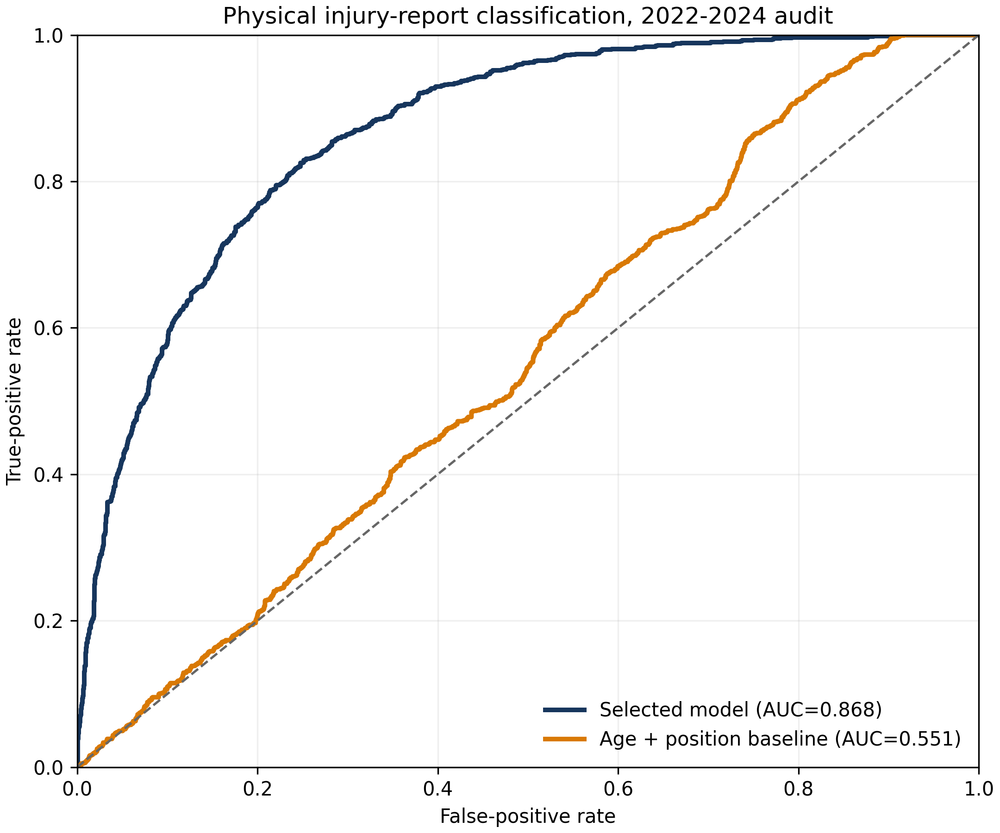
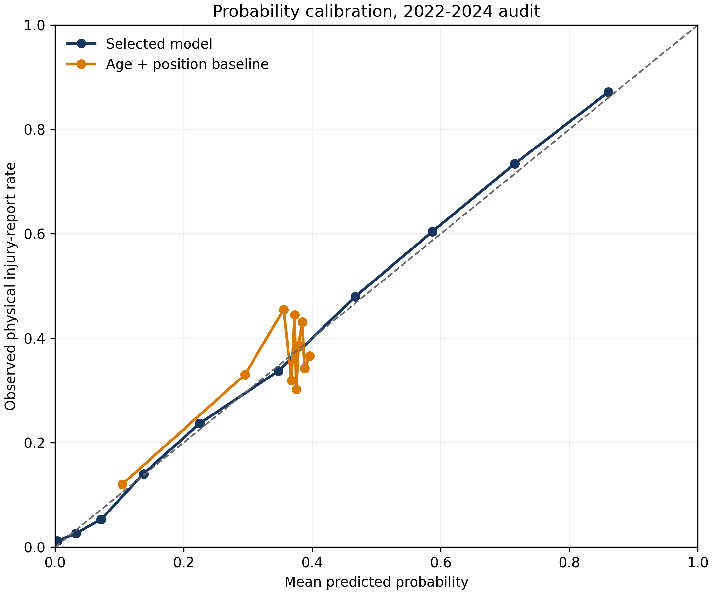
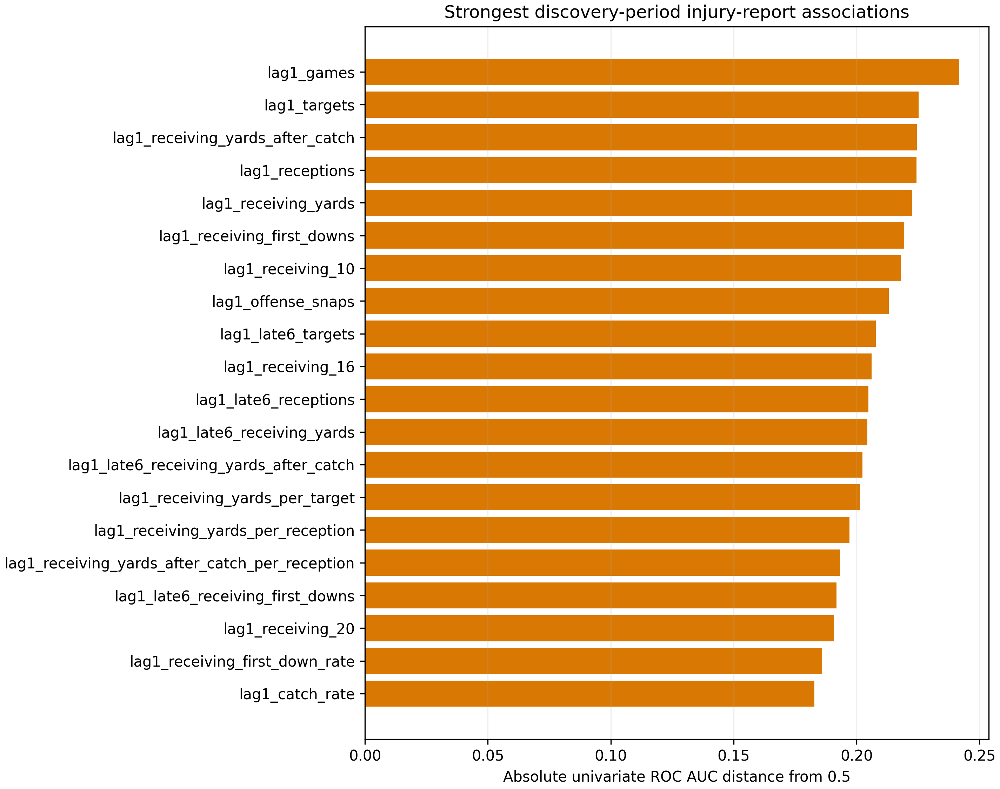

# Phase 3 Methods and Results

## Answer

The strongest predeclared procedure was a calibrated Extra Trees classifier using all 500 leakage-controlled inputs. It reached pooled 2022-2024 ROC AUC 0.8676, with a player-cluster 95% bootstrap interval of 0.8537 to 0.8804. Its average precision was 0.7632 at 0.3494 prevalence. Probability calibration was close to ideal on the pooled audit: intercept 0.0417 and slope 1.0281.

The model estimates the chance of any physical injury-report designation. It does not estimate a season-ending injury, games missed, or an anatomical failure rate.

## Data and label

The official nflverse weekly injury files provide 84,684 rows from 2009-2024. The primary analysis retains regular-season rows and links players by GSIS ID. A candidate is positive if any report or practice field contains a physical designation during the season. Nonphysical reasons named in the pre-fit plan are removed.

The Phase 2 August candidate rule supplies the historical risk set: prior-season roster members plus target-year draft or combine entrants. Candidates with no matched physical report are observed negatives. This makes the estimand useful for a preseason list, but it also means that release or league exit can appear as a negative. Exact historical August rosters are unavailable.

The labeled modeling table has 12,434 player-seasons from 2013-2024. The current inference table has 958 players for 2026, of whom 951 are available in the draft workbook.

## Chronological design

Model selection used validation seasons 2017-2021. For each validation season `y`:

1. Feature association, imputation, and the base classifier used seasons through `y - 2`.
2. Sigmoid probability calibration used only `y - 1`.
3. Metrics used only `y`.

The grid contained 21 procedures: an age-and-position baseline, elastic-net logistic regression, Extra Trees, and histogram gradient boosting. Feature limits were 16, 32, 64, or all where declared. The selection rule first found the best mean ROC AUC, retained procedures within 0.005, then minimized mean log loss and feature count.

The winner was `extra_trees_all_leaf20`:

- 300 trees
- minimum leaf size 20
- 70% of features considered per split
- all 500 inputs
- sigmoid calibration on the immediately preceding labeled year

Its mean development ROC AUC was 0.8424. The 64-feature Extra Trees alternative reached 0.8330, outside the 0.005 tolerance. This experiment does not support a compact injury-report feature set under the declared rule.

## Negative control

Eleven end-to-end fits permuted training and calibration labels within season and position, while evaluation retained the real validation labels. Mean pooled ROC AUC was 0.5220, inside the predeclared 0.45 to 0.55 gate. Individual seeds ranged from 0.4787 to 0.5565, and 10 of 11 exceeded 0.5.

The gate passed, but the right shift warrants restraint. It can arise when preserved group prevalence and feature geometry predict the real label distribution without a direct row-level label path. The observed audit AUC is far above this null distribution, but the control does not prove that every possible source artifact is absent.

## Locked audit

For numerical stability, reported probability metrics clip only values below `1e-6` or above `1 - 1e-6`. The player artifacts retain the unrounded calibrated probabilities used for ranking and the combined score.

| Metric | Selected model | Age + position baseline |
|---|---:|---:|
| Pooled ROC AUC | 0.8676 | 0.5514 |
| Average precision | 0.7632 | 0.3723 |
| Log loss | 0.4297 | 0.6227 |
| Brier score | 0.1402 | 0.2200 |
| Calibration intercept | 0.0417 | -0.0791 |
| Calibration slope | 1.0281 | 0.8004 |

| Audit season | ROC AUC | Average precision | Brier score |
|---|---:|---:|---:|
| 2022 | 0.8458 | 0.7250 | 0.1528 |
| 2023 | 0.8836 | 0.7935 | 0.1289 |
| 2024 | 0.8727 | 0.7754 | 0.1397 |

Position ROC AUC was 0.8574 for QB, 0.8505 for RB, 0.8982 for WR, 0.8473 for TE, and 0.7093 for K.

## Strongest associations

The strongest discovery-period univariate signal was prior-year games, with ROC AUC 0.7418 and Spearman correlation 0.4164. Prior targets, receptions, receiving yards, yards after catch, first downs, and offense snaps followed. These variables measure exposure and established role as well as susceptibility.

The most recent deployable injury-history signal is two seasons old because the 2025 feed is missing. Its event flag reached audit AUC 0.6228. In the discovery association table, lag-two injury designation count and report weeks each reached discriminative AUC about 0.622 and ranked 42nd and 43rd among 500 inputs.

## Exposure diagnostic

The headline result partly separates players likely to participate and accumulate report exposure from players likely to leave the candidate pool.

| Pre-cutoff subgroup | Rows | Positive rate | Selected model AUC | Prior-games AUC |
|---|---:|---:|---:|---:|
| All audit candidates | 3,417 | 0.349 | 0.868 | 0.772 |
| Prior-year games > 0 | 1,982 | 0.496 | 0.789 | 0.731 |
| Prior-year games >= 4 | 1,594 | 0.573 | 0.750 | 0.664 |
| Prior-year games >= 8 | 1,231 | 0.644 | 0.729 | 0.591 |

These subgroups use only pre-cutoff information, but they were evaluated after the model was selected. They show that the model retains discrimination among established players while bounding the claim: it is an injury-report risk model, not a pure fragility model.

## 2026 score

The production model fits base trees through 2023, calibrates on 2024, and predicts 2026. Injury history uses 2024, 2023, 2022, and 2021 through target offsets two through five. No 2025 injury label is inferred from roster status.

The default draft score gives 80% weight to the within-position percentile of raw Phase 2 points and 20% to the probability of no physical injury report. It preserves raw fantasy value as the primary signal. Use the raw points and risk columns separately when a different risk preference is appropriate.

The [Excel draft board](../../outputs/injury_adjusted_draft_board_2026.xlsx) has `ALL`, `QB`, `RB`, `WR`, `TE`, `K`, and `INJURED` sheets, with no read-me sheet. The `ALL` and position pages exclude 109 players who matched a current public injury listing as of August 14, 2026. Those rows retain their original model outputs on `INJURED`. Every sheet sorts by the risk-adjusted score.

The workbook keeps three distinct decision fields: `Risk-Adjusted Draft Score`, `Projected 2026 Fantasy Points`, and `Predicted Physical Injury-Report Probability`. The current-status screen is an operational filter after modeling. It does not overwrite the prospective injury probability, refit the model, or claim that the 842 players without a matched listing are healthy.

## Limits

- The outcome is report presence, not medical truth or missed games.
- High-usage players have more opportunities to appear on a report.
- Historical August roster membership is reconstructed, not observed exactly.
- The injury feed ends in 2024, so current injury history is one season stale.
- The audit is chronological and procedure-locked but not analyst-blinded.
- The 2026 season is the prospective test.
- The combined 80/20 weight is a decision preference, not an empirically optimal utility function.
- Training-camp `Questionable` listings are not standardized Week 1 game designations and may resolve before the season.
